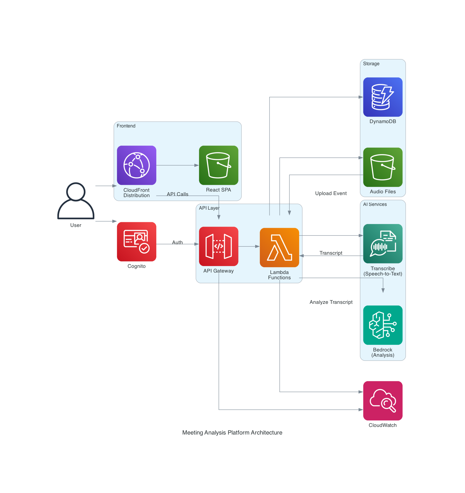

## Serverless Meeting Analyzer

A serverless web application for uploading, transcribing, and analyzing meeting recordings using AWS services.

### Architecture



- **Frontend**: React + Vite + AWS Cloudscape, hosted on S3/CloudFront
- **API**: API Gateway + Lambda (TypeScript)
- **Storage**: DynamoDB + S3
- **AI**: Amazon Transcribe + Amazon Bedrock
- **Auth**: Amazon Cognito

### Quick Start

#### 1. Deploy Infrastructure

```bash
# Install dependencies
npm install

# Build the shared dependencies
npm run build --workspace=packages/shared

# Build the frontend
npm run build --workspace=packages/frontend

# Deploy all infrastructure
cd packages/infrastructure
cdk bootstrap
npm run deploy:all
```

This deploys all stacks and automatically configures CloudFront callback URLs.

#### 2. Create a Cognito User (Required for Testing)

Before using the application, you must create a user in Cognito:

1. Go to the [AWS Cognito Console](https://console.aws.amazon.com/cognito)
2. Select your User Pool (created during deployment)
3. Go to **Users** → **Create user**
4. Fill in the required fields:
   - Username (email)
   - Temporary password
5. Click **Create user**
6. On first login, you'll be prompted to set a permanent password

#### 3. Access Your Application

- **Production**: `https://<cloudfront-domain>` (from deployment output)
- **Local Development**: `http://localhost:5173` (see below)

#### 4. Configure Word Template

After logging in:

1. Go to **Settings** in the application
2. Upload a Word template (`.docx` file)
3. Ensure your template contains `{{placeholders}}` for dynamic content replacement
4. The application will autocomplete available placeholders based on your template

Example placeholders you might use:
- `{{meeting_title}}`
- `{{meeting_date}}`
- `{{attendees}}`
- `{{summary}}`
- `{{action_items}}`

### Run Frontend Locally

```bash
# Build shared types
cd packages/shared && npm run build

# Configure frontend environment with values retrieved from your cdk output or AWS console
cd packages/frontend
cp .env.example .env.local
# Edit .env.local with values from your CDK deployment outputs
```

Example `packages/frontend/.env.local`:
```bash
VITE_COGNITO_USER_POOL_ID=us-east-1_xxxxxxxxx
VITE_COGNITO_CLIENT_ID=xxxxxxxxxxxxxxxxxxxxxxxxxx
VITE_COGNITO_IDENTITY_POOL_ID=us-east-1:xxxxxxxx-xxxx-xxxx-xxxx-xxxxxxxxxxxx
VITE_COGNITO_DOMAIN=meeting-platform-xxxxxxxxx.auth.us-east-1.amazoncognito.com
VITE_API_URL=https://<cloudfront-domain>/api
VITE_AWS_REGION=us-east-1
```

```bash
# Start frontend dev server
npm run dev
```

Frontend runs at `http://localhost:5173` and uses the deployed backend.

### Project Structure

```
meeting-analysis-platform/
├── packages/
│   ├── shared/          # Shared TypeScript types and interfaces
│   ├── frontend/        # React frontend application
│   └── infrastructure/  # AWS CDK infrastructure code
└── package.json         # Root workspace configuration
```

## Security

See [CONTRIBUTING](CONTRIBUTING.md#security-issue-notifications) for more information.

## License

This library is licensed under the MIT-0 License. See the LICENSE file.

